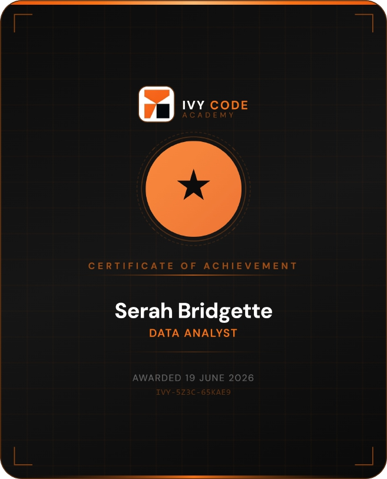
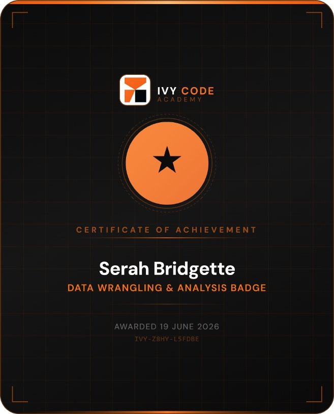

# Professional Certifications & Digital Badges

Welcome to my certifications repository.

This repository contains verified digital badges earned during my Data Science Masterclass journey at Ivy Code Academy.

These certifications reflect my growing expertise in Python, SQL, Data Analysis, and Machine Learning, as I continue building practical projects in Data Science and AI.
## Issued By
Ivy Code Academy

## Course
Data Science Masterclass

## Earned Badges
🏅 Python Foundations  
🏅 Data Wrangling & Analysis Badge  
🏅 Data Analyst  
🏅 Applied Machine Learning  
🏅 SQL for Data Science Badge  

## Skills Covered
- Python Programming
- SQL for Data Science
- Data Cleaning
- Data Wrangling
- Data Analysis
- Exploratory Data Analysis (EDA)
- Data Visualization
- Machine Learning
- Supervised Learning
- Model Training & Evaluation
- Feature Engineering
- Problem Solving with Data

I am continuously building practical projects in Data Science, Machine Learning, and AI.

## Verification Links
Badge 1 (Python Foundations): https://ivytechacademy.com/badge/verify/IVY-HBPP-QHPMCS 
Badge 2:(Data Wrangling & Analysis Badge ):  https://ivytechacademy.com/badge/verify/IVY-Z8HY-L5FDBE
Badge 3:(Data Analyst):  https://ivytechacademy.com/badge/verify/IVY-5Z3C-65KAE9
Badge 4:(Applied Machine Learning):  https://ivytechacademy.com/badge/verify/IVY-2586-SCRJWX
Badge 5:( SQL for Data Science Badge ):  https://ivytechacademy.com/badge/verify/IVY-HUUD-PRJZXF
#Badge Gallery
## Badge Gallery

### Python Foundations

### Data Wrangling & Analysis

### Data Analyst

### Applied Machine Learning

### SQL for Data Science

